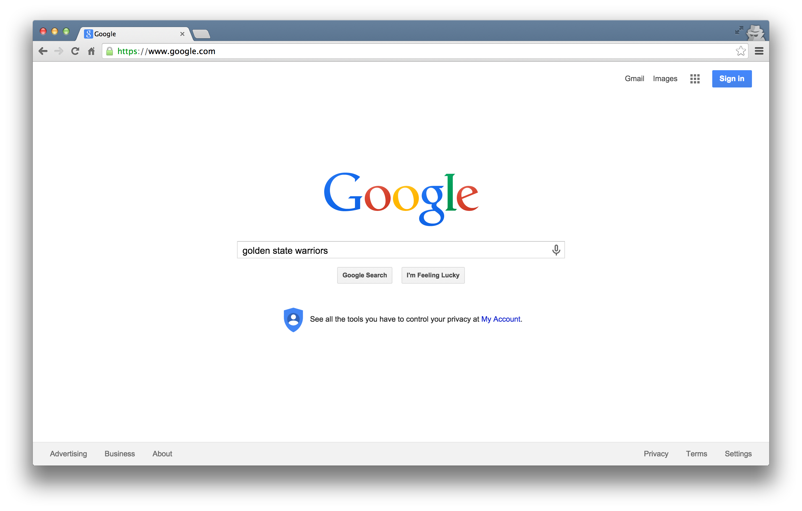
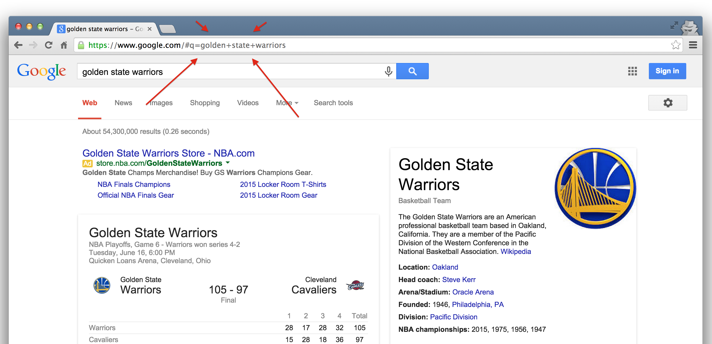

# Accessing Data: Some Preliminary Considerations

Whenever you're trying to get information from the web, it's very important to first know whether you're accessing it through appropriate means.

The UC Berkeley library has some excellent resources on this topic. Here is a flowchart that can help guide your course of action:

You can see the library's licensed sources [here](http://guides.lib.berkeley.edu/text-mining).

# What is an API?

This workshop begins with APIs. You may have heard this terminology in a variety of programming settings. What exactly does it mean?

* "API" stands for **Application Programming Interface**.

* Broadly defined, an API is a set of rules and procedures that facilitate interactions between computers and their applications.

* A very common type of API is the Web API, which, among other things, allows users to query a remote database over the internet.

* For example, a web service such as Twitter has many databases that may be of use to us: Tweets, Users, Replies, etc. If we want to access some portion of these databases, it'd be helpful to have a set of rules and protocols in place to outline how we access this information. This is the motivation for an API.

* Web APIs take on a variety of formats, but the vast majority adhere to a particular style known as **Representational State Transfer** or **REST**.

* What makes these "RESTful" APIs so convenient is that we can use them to query databases using URLs.

## RESTful Web APIs Are All Around You

Consider a simple Google search:

Ever wonder what all that extra stuff in the address bar was all about?  In this case, the full address is Google's way of sending a query to its databases asking requesting information related to the search term "golden state warriors". 

In fact, it looks like Google makes its query by taking the search terms, separating each of them with a "+", and appending them to the link "https://www.google.com/#q=".  Therefore, we should be able to actually change our Google search by adding some terms to the URL and following the general format:

Using RESTful APIs is essentially formatting these URLs so that you can get the response you want.

## Some Terminology

* **Uniform Resource Locator (URL)**: a string of characters that, when interpreted via the Hypertext Transfer Protocol (HTTP), points to a data resource, notably files written in Hypertext Markup Language (HTML) or a subset of a database.  This is often referred to as a "call".

* **HTTP Methods/Verbs**:

    + *GET*: requests a representation of a data resource corresponding to a particular URL.  The process of executing the GET method is often referred to as a "GET request" and is the main method used for querying RESTful databases.
    
    + *HEAD*, *POST*, *PUT*, *DELETE*: other common methods, though mostly never used for database querying.
    
As you might suspect from the example above, surfing the web is basically equivalent to sending a bunch of GET requests to different servers and asking for different files written in HTML.

## API Examples

- [**X / Twitter**](https://developer.x.com/en/):
Used for pulling X data, posting status updates, and more. Free version allows you to pull 1,500 posts per month.

- [**Spotify**](https://developer.spotify.com/):
Access to rich song data data such as valence, energy, and danceability metrics.

-  [**Watson IBM Natural Language Inference API**](https://cloud.ibm.com/apidocs/natural-language-understanding):
Use state of the art NLP models to analyze text sentiment, extract named entities, and classify text.

# The New York Times API

Now, we turn to our main case study of the API portion: the New York Times API.

## All the News That's Fit to Query

The New York Times offers a treasure trove of data about their articles that is easily accessible and available for free! We'll now get set up with API keys so that we can make some API calls to the NYT servers.

## Getting API Access

For most APIs, a key or other user credentials are required for any database querying.  Generally, this requires that you register with the organization. Go to the [NYT Developer Page](http://developer.nytimes.com/) and create an account:

Most APIs are set up for developers, so you'll likely be asked to register an "application".  All this really entails is coming up with a name for your project, and providing your real name, organization, and email.  Note that some more popular APIs (e.g. Twitter, Facebook) will require additional information, such as a web address or mobile number.

## Getting your API Keys

Once you've successfully registered, you will be assigned one or more keys, tokens, or other credentials that must be supplied to the server as part of any API call you make.  To make sure that users aren't abusing their data access privileges (e.g. by making many rapid queries), each set of keys will be given several **rate limits** governing the total number of calls that can be made over certain intervals of time.  For the NYT Article API, we have relatively generous rate limits: 10 calls per minute and 4,000 calls per day.

1. Login with your new username and password.

2. Click on your email in the top right corner and you'll see a dropdown menu that says **Apps**

3. Click on **Apps** and then click on the **+ New App** button.

4. You'll see the page where you'll be prompted to add a name for your App. You can call it anything. Then click enable on the APIs that are enabled in the screenshot. You can enable them all but make sure you at least enable the ones on the screenshot. 

5. You'll see an API key next to your App ID. Have that key ready to copy into the first notebook.

Proceed to the `lessons/01_api.ipynb` notebook with your API key to make some calls!
